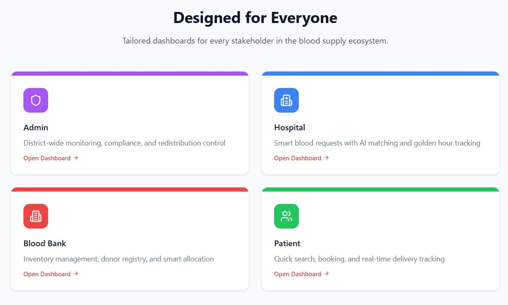
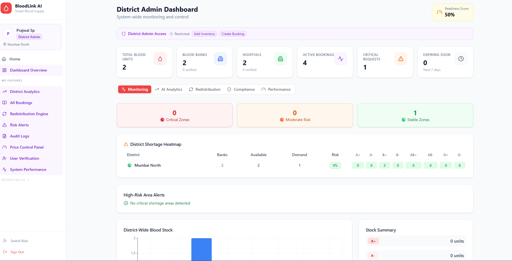
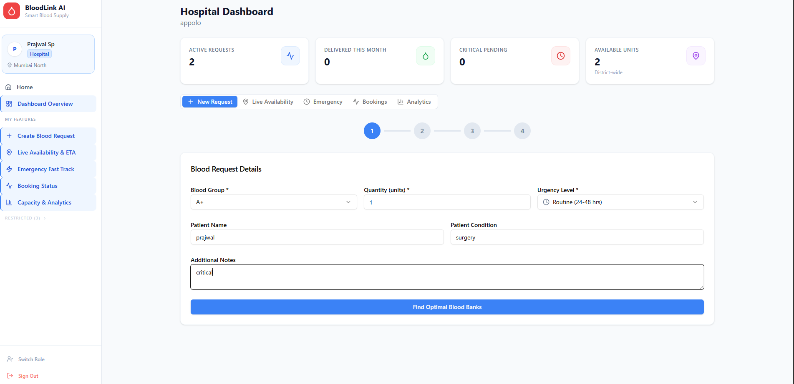
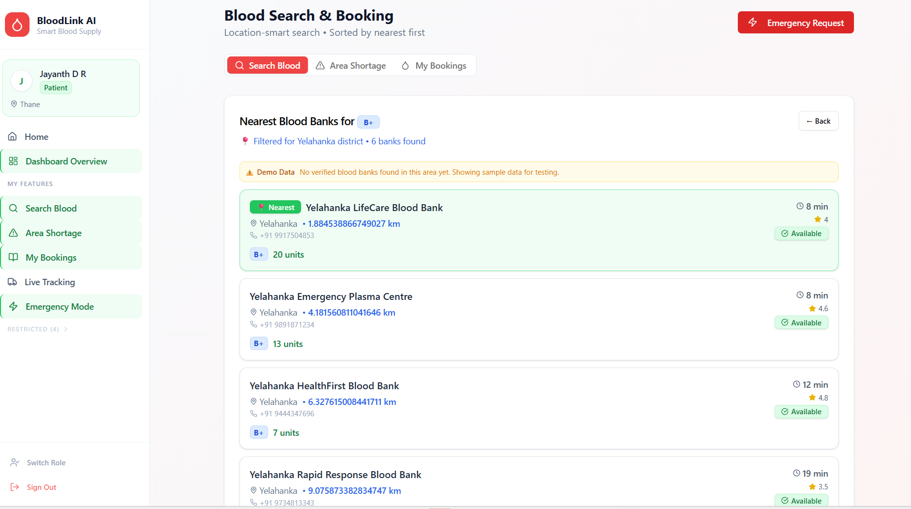

12345
## **BloodLink-AI**

## 📌 Overview

- BloodLink-AI is a district-level AI-enabled blood management and emergency coordination platform designed to eliminate fragmentation, inefficiency, and wastage in blood supply systems.

# It connects:
- 🏛 District Health Authorities
- 🏦 Blood Banks
- 🏥 Hospitals
- 👤 Patients / Emergency Users
---
## 🚨 Problem Statement

During healthcare crises (e.g., COVID-19, accident surges, surgical backlogs), blood supply systems failed due to:
-  Lack of centralized district-level visibility
-  Manual phone-based coordination
-  Blood expiry and wastage
-  No predictive shortage system
-  Delayed emergency response
-  No standardized pricing or transparency
-  No real-time audit tracking
---

## Failure Cases Observed
- Fragmented Inventory Systems

- Expiry-Based Wastage

-  Manual Coordination Delays

-  No Demand Prediction

- Lack of Governance Control

## 💡 Our Solution

- BloodLink-AI introduces a Unified District Blood Orchestration System that:
- Integrates blood banks into one intelligent platform
- Enables AI-based matching and allocation
- Tracks expiry using FIFO logic
- Simulates mortality risk and golden-hour impact
- Predicts shortages and suggests redistribution
- Provides governance-level analytics

## It is not just a blood finder.
# It is a district command center.
---
## 🤖 Innovation
-  AI-Based Compatibility Matching
-  FIFO Expiry Optimization
-  Redistribution Engine
-  Hospital Capacity Scoring
-  Mortality Risk Simulation
- Estimates survival probability based on:

Delay time
ICU load
Blood availability

- Golden Hour Intelligence
- District Readiness Score
---
Calculates system preparedness using supply, demand, and emergency load.

## 👥 User Roles & Access
## 🏛 Admin (District Authority)

-District analytics dashboard
- Supply vs demand charts
- Risk classification
- Redistribution control
- Audit logs
- Performance metrics

## 🏦 Blood Bank

- Inventory management
- Expiry tracking
- Low stock alerts
- Approve/reject requests
- Donor registry
- Dispatch tracking

## 🏥 Hospital

- Smart blood request
- Urgency prioritization
- ETA tracking
- Survival probability view
- Hospital capacity scoring

## 👤 Patient/User

- Search blood by group
- View availability
- Emergency fast-track

## Track delivery
---
## 📈 How It Benefits the Ecosystem

- Faster blood procurement
- Reduced emergency delays
- Intelligent prioritization

- Reduced expiry wastage
- Smarter allocation
- Better demand visibility

- Governance control
- Performance monitoring
- Risk forecasting
- Data-driven decision-making

- Faster emergency access
- Transparent availability
- Improved survival chances
 ---
##  Screenshots

### Home Screen

### admin

### Hospital

### Patient

---
## 📌 Future Enhancements

- Real-time map heat overlays
- SMS-based emergency alerts
- Blockchain-based audit transparency
- AI-based seasonal demand forecasting
- Inter-district blood balancing

## 🔒 Security Model

- Simulated JWT authentication
- Role-based access control
- Module-level authorization
- Audit log schema
